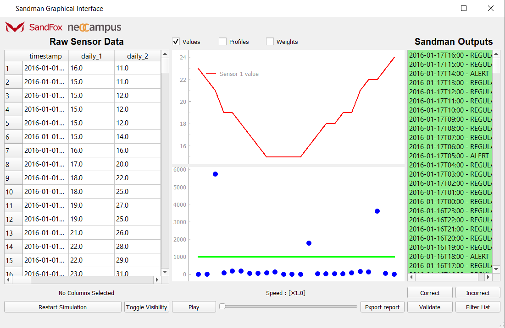
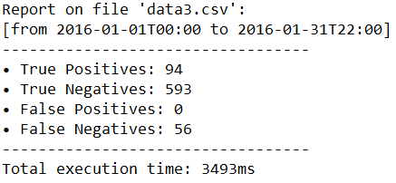
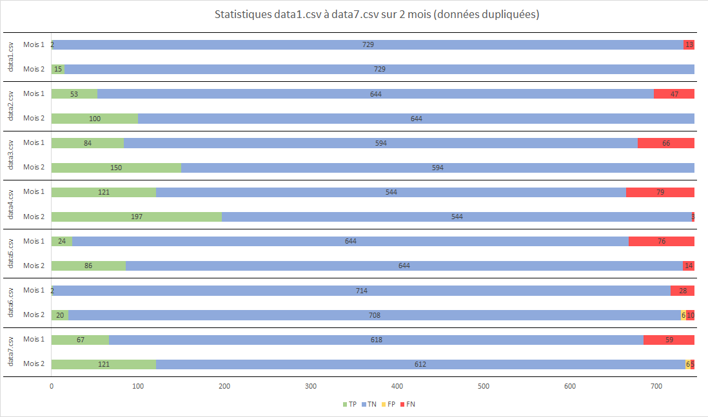
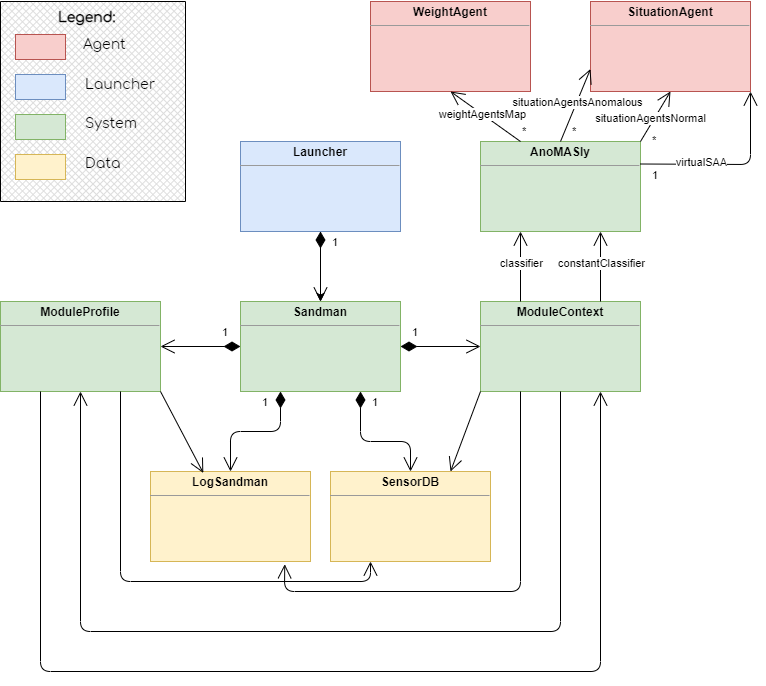
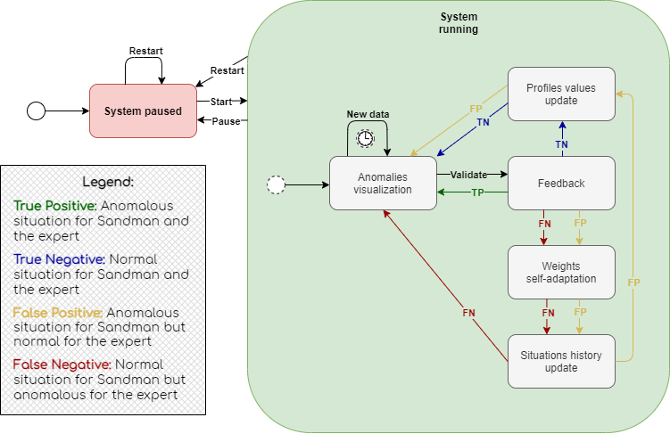
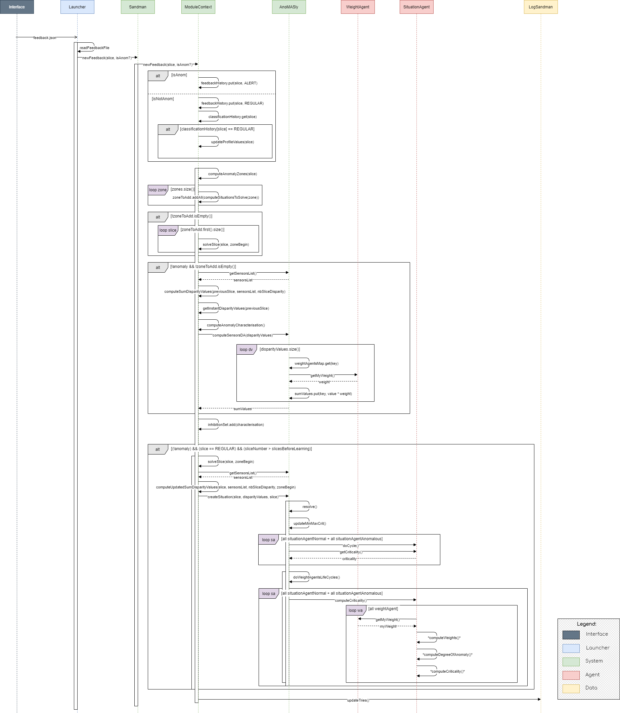

# SANDMAN : a Semi-Supervised ANomaly Detection with Multi-AgeNt systems

## Installation

### Java application
Open the project in **Eclipse**

> File > Import > General > Existing Projects into Workspace

### Python interface
System Requirements:
* Python 3.8
* Java 8 (jre1.8)

For the **Python interface**, the following modules are required:
* PyQt5 v5.14.1
* matplotlib v3.1.2

To install all the requirements do in a terminal the following commands 
> cd myPath\GraphicalInterface_v1.3

(put instead your path for the directory containing the requirements.txt file)

> pip install -r requirements.txt

(automatically install all the requirements listed in the file using the pip packet manager)

*NOTE: The pipenv virtual environment was used for testing, but with small modifications to the launching file, any other python environment could be used.*

## First Use

### Windows
#### Batch (.bat) file

Open the file *run_interface.bat* (*Anomasly/run_interface.bat*) in a text editor

Replace lines 2 and 3 with the system commands you would enter to launch the **Python interface**

*i.e. Replace the file path with your own file path and replace the pipenv command with whatever command you would usually use*

#### Launching the System
To launch the system, open the **Anomasly project** in the **Eclipse development environment**

Navigate to the *Launcher.java* file (*Anomasly/src/controller/Launcher.java*)

Ensure that the line
> String cmd = "run_interface.bat"; // For Windows

**IS NOT** commented and that the following line
> String cmd = "run_interface_unix.bash"; // For Mac/Unix

**IS** commented out

Run the file like this:
> Run as > Java Application

### Mac OS/Unix
#### Bash (.bash) file
Open the file *run_interface_unix.bash* (*Anomasly/run_interface_unix.bash*) in a text editor

Replace lines 2 and 3 with the system commands you would enter to launch the **Python interface**

*i.e. Replace the file path with your own file path and replace the pipenv command with whatever command you would usually use*

#### Launching the System
To launch the system, open the **Anomasly project** in the **Eclipse development environment**

Navigate to the *Launcher.java* file (*Anomasly/src/controller/Launcher.java*)

Ensure that the line
> String cmd = "run_interface_unix.bash"; // For Mac/Unix

**IS NOT** commented and that the following line
> String cmd = "run_interface.bat"; // For Windows

**IS** commented out

Run the file like this :
> Run as > Java Application

*NOTE: The system has not been tested on a Mac OS/Unix system, so there may be some issues*

## Presentation of the system
### Java application
We launch the **application** by running the *Launcher class*. Then, the **system** is listening for an input in the *Input folder*.

The input is a command in a *json file*.

* play.json : To play / pause
* start.json : To start the reading
* feedback.json : To process the feedback of the expert
* timer.json : To set the timer (speed or slow the processing of data)

Currently all these files input are handled by the **Python interface**.

### Python interface
The path and name of the input file is specified (currently at line 65 of the *main.py* program) here :
> self.data_file = os.path.join(os.path.curdir, 'Anomasly', 'Data', 'noisy_data1.csv')

Once the file is loaded, the **UI** launches and the user can interact with it.

The actions of the user affect the **interface** and the **Java application**; for example on a click on the **Start** button, a *start.json* file is created and put inside the *Input* folder for the **Java application** to process it.

## Utilisation of the interface

### Raw Sensors Data
Excel-like view of the data, the lines represent the samples through time.

The array is labeled according to the first line of the original data file.

Usually the first column represents the timestamp as shown in the example, the next columns are the values of each sensor and the last one shows if there is an anomaly in the line.

### Sandman Output
One line displayed per second corresponding to one hour of data here (deferred mode).

Displays **ALERT** if one is detected or **REGULAR**, with the related timestamp.

### Buttons
* Data View
    * **Restart Simulation** : Restart the simulation from the selected timestamp (default to first timestamp if none selected)
    * **Toggle Visibility** : Add or remove selected sensors from the plot (only select one sensor column at a time) 
* General
    * **Pause** / **Play** : Starts and stop the stimulation
    * **Time slider** : Speeds or slows the processing of data
    * **Export report** : Creates a report with the stats of the current session in the folder *Reports*
* Expert View
    * **Correct** : Marks items as correct for sandman feedback
    * **Incorrect** : Marks items as incorrect for sandman feedback
    * **Validate** : Validates currently selected feedback and sends it to sandman
    * **Filter List** : Filters list to only show ALERT outputs

### Plots
* **Sensors plot** : Displays the values of the selected sensors (sliding 24 last values) according to the following checkboxes :
    * **Values** : Show/hide the values of the sensors
    * **Profiles** : Show/hide the nominal values of the sensors
    * **Weights** : Show/hide the weight values of the sensors
* **Anomalies degrees**
    * Displays the anomaly degrees for the last 24 sliding situations in blue dots; when a dot is clicked, the corresponding lines on the CSV file and Sandman output are selected
    * Displays the threshold as a green line (any point above is an anomalous situation, any point below is a normal situation)

### Feedback mode
Usually, the expert can use the buttons on the expert view to give feedback to the system on its output, but for the tests, the system uses a "direct feedback mode" : at every step, the system simulates the action of the expert (selection of last output, lcick on correct or incorrect and click on validate) using the 21st column of the CSV file to know if there is really an anomaly (if there is a 'A' on the corresponding row) or not

### Report
The report contains the following data :
* **Name of the *.csv*** source file
* **First and last feedback** timestamp
* Number of
    * **True Positives**
    * **True Negatives**
    * **False Positives**
    * **False Negatives**
* **Execution time**

## Example of a report

## Stats of the report for 7 data files with two consecutives executions (2 months)

## Chart displaying the stats of the report for 7 data files with two consecutives executions (2 months)

## Simplified class diagram of the project

## State diagram showing the steps following a feedback given by an expert on the interface

## Sequence diagram showing how the system processes a feedback given by an expert on the interface

